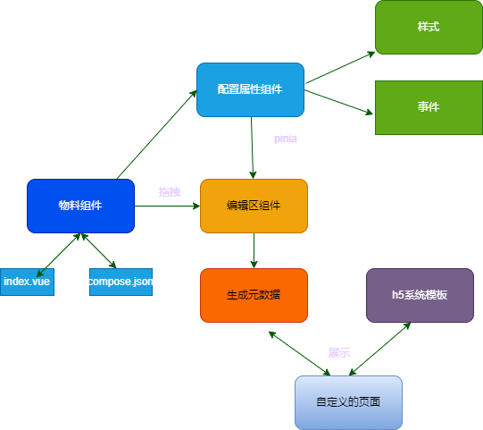

# SpeedUp

## 项目介绍

```
7天教会你h5可视化拖拽生成营销h5，探索低代码生成h5营销之路
```
## 项目效果视频

[链接](https://img.soogif.com/video/2ea0a32107264b96b8fd778257b95eb4.mp4)

## 架构图



## 目录结构

```
    ├─src  	            （项目核心目录）
    |  ├─assets         （资源目录）
    |  ├─components     （系统组件比如编辑区呀，物料组件区、配置区）
    |  ├─custom-components         （物料组件目录）
    |  ├─router         （路由）
    |  ├─store          （数据存储）
    |  ├─utils          （工具包）
    |  ├─views          （路由视图层）
    |  ├─App.vue        （app组件）
    |  ├─main.js        （入口文件）
    ├─public            （包含模板文件）
    ├─.gitigonre        （git的忽略配置文件）
    ├─babel.config.js  	（babel的配置文件，babel是js编译器）
    ├─package.json  	（npm包管理的配置文件）
    ├─vue.config.js     （vue的配置文件）

```

## Project setup
```
yarn install
```

### Compiles and hot-reloads for development
```
yarn dev
```

### Compiles and minifies for production
```
yarn build
```

### Lints and fixes files
```
yarn lint
```

### Customize configuration
See [Configuration Reference](https://cli.vuejs.org/config/).

### 1 days 初始化项目

```
## 项目初始化

### 全局安装vue-cli
 npm install -g vue-cli

###
 vue create 项目名称

### 

 npm i vue 
 npm i vue-router^3
 npm i element-ui
 npm i @vue/composition-api pinia 
 npm i nanoid 
 npm i sass sass-loader^8 --save-dev
 
```

### 2 days 

* 实现全局组件注册、全局物料注册
* 编辑区实现拖拽


### 3 days

* 完善编辑区,支持组件在编辑区拖动
* 点击当前组件展示右侧属性配置
* 实现预览功能

### 4 days

* 实现保存、撤销和恢复、清空画布功能
* 新增跳转页面去预览功能（模拟手机端访问）

### 5 days


* 实现事件配置、事件绑定
* 优化部分代码


### 6 days


* 背景图上传替换
* 新增用户信息组件
* 添加登录方法
* npm i babel-plugin-import -D
*  npm i vant@latest-v2
* 添加抽奖方法

### 7 days

* 新增分享按钮组件
* 优化代码,比如移动端兼容方案（rem处理）
* 完善功能
* 录制视频
* npm install postcss-plugin-px2rem --save-dev


### 8、咨询作者


